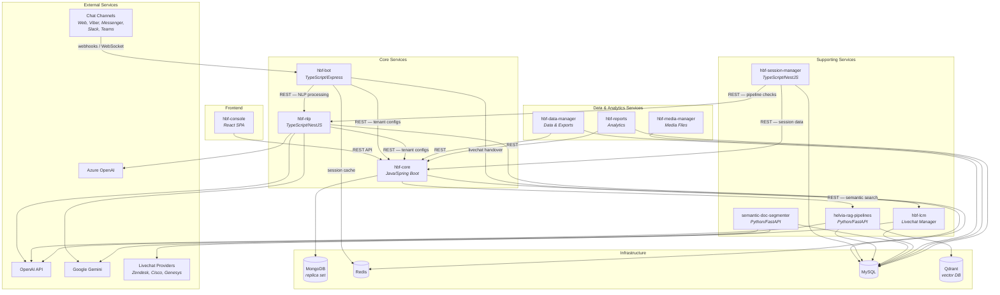

# Architecture

Visual overview of the Helvia.ai Platform service topology, showing how services communicate and what infrastructure they depend on.

## Component Diagram

## Service Roles

| Service | Role |
|---------|------|
| **hbf-core** | Central backend — single source of truth for all platform configuration and data |
| **hbf-console** | Frontend console — visual no-code editor for organizations, agents, and flows |
| **hbf-bot** | Chatbot executor — runs agent configurations in real-time chat channels |
| **hbf-nlp** | NLP/LLM processing — intent classification, text generation, pipeline execution |
| **hbf-session-manager** | Session lifecycle — inactivity detection, completion triggers, auto-retraining |
| **hbf-lcm** | Livechat routing — human agent handover via Zendesk, Cisco, Genesys, etc. |
| **helvia-rag-pipelines** | RAG & semantic search — embeddings, vector indexing, retrieval |
| **semantic-doc-segmenter** | Document processing — ingestion, markdown conversion, chunking, tagging |
| **hbf-data-manager** | Data operations — bulk exports and data processing for analytics |
| **hbf-media-manager** | Media management — file upload, storage, and retrieval |
| **hbf-reports** | Analytics — aggregated reports on conversations, agents, and engagement |
