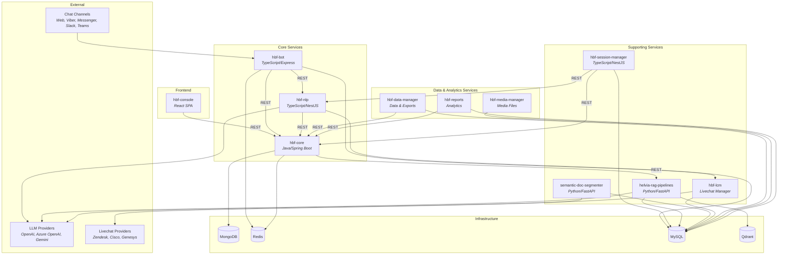

# API Reference Overview

The Helvia.ai Platform exposes REST APIs through multiple services. Each service handles a specific domain of the platform's functionality.

## Architecture

## Services

| Service | Description |
|---------|-------------|
| **hbf-core** | Central backend API — manages organizations, agents (tenants), users, sessions, flows, knowledge bases, and integrations. Single source of truth for all platform configuration and data. |
| **hbf-nlp** | NLP and LLM processing — handles intent classification, text generation, language detection, and pipeline execution via Azure OpenAI, OpenAI, and Google Gemini. |
| **hbf-session-manager** | Session lifecycle management — monitors sessions for inactivity, triggers completion actions (summarization, webhooks, surveys), and manages NLP pipeline retraining. |
| **helvia-rag-pipelines** | RAG and semantic search — manages document corpora, generates embeddings, indexes them in Qdrant, and performs vector-based retrieval for grounded LLM responses. |
| **semantic-doc-segmenter** | Document processing — ingests documents (PDF, DOCX, PPTX, HTML, MD, TXT), converts to Markdown, segments into semantic chunks, and optionally tags via LLMs. |
| **hbf-lcm** | Livechat management — routes conversations to human agents on escalation, supporting Zendesk, Cisco, Genesys, and Helvia's built-in livechat. |
| **hbf-data-manager** | Data management — provides bulk data operations, exports, and processing for analytics and reporting workflows. |
| **hbf-media-manager** | Media management — handles upload, storage, and retrieval of media files (images, documents, audio) used in conversations and knowledge bases. |
| **hbf-reports** | Reporting and analytics — generates aggregated reports on conversation metrics, agent performance, and user engagement for the console dashboard. |
| **hbf-bot** | Chatbot executor — runs agent configurations in real-time chat channels (Web, Viber, Messenger, Slack, Teams). No OpenAPI spec. |

## Common Patterns

All API services follow these conventions:

- **Content-Type**: `application/json` for request and response bodies
- **Authentication**: Bearer token via the `Authorization` header (see [Authentication](authentication.md))
- **Error responses**: Standard HTTP status codes with JSON error bodies
- **CORS**: Enabled for all origins in local development

## OpenAPI Specs

Each service (except hbf-bot) provides an OpenAPI specification. The specs are available:

- **At runtime** via each service's Swagger UI endpoint
- **As static files** in the [`specs/`](../specs/) directory of this repo
